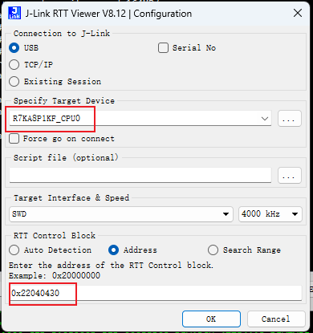
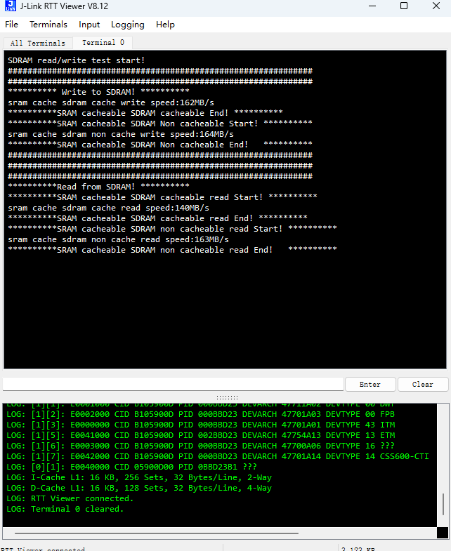

## 1.参考例程概述
该示例项目演示了基于瑞萨 RA8p1 SDRAM 性能测试的功能，本工程通过DWT counter计算读写SDRAM的时间，并通过J-Link RTT打印输出对应的结果。
Jlink_RTT viewer配置如下：

### 1.1 打开工程

### 1.2 编译，下载，运行

## 2. 结果分析

### 2.1 读写速率测试

* 打开 BENCH_MARK 这个宏定义会对SDRAM的读写速率进行测试，关闭这个宏定义会对SDRAM做全功能的读写测试

## 4. 支持的电路板：
CPKCOR-RA8P1

## 5. 硬件要求：
1块瑞萨 RA8P1 COR板：CPKCOR-RA8P1

1根 Type-C USB 数据线

## 6. 硬件连接：
通过Type-C USB 数据线将 CPKCOR-RA8P1板上的 USB 调试端口（JDBG）连接到主机 PC
连接屏幕到板子