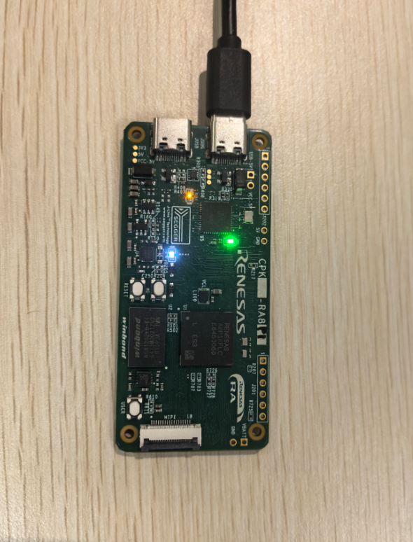

该示例工程由 瑞萨电子-Deane 提供，2026年01月20日

#### 工程概述:
* 该示例工程演示了基于CPKHMI-RA8P1开发板的16位SDRAM驱动及读写速率的测试。

#### 支持的开发板 / 演示板：
* CPKHMI-RA8P1

#### 硬件要求：
* 1块 Renesas RA8开发板：CPKHMI-RA8P1
* 1根 USB Type A->Type C 或 Type-C->Type C 线 （支持 Type-C 2.0 即可）

#### 硬件连接：
* 通过 USB Type-C 线连接调试主机和 CPKHMI-RA8P1板上的 USB 调试端口。

#### 硬件设置注意事项：
* 无

#### 软件开发环境：
* FSP版本
  * FSP 6.1.0
* 集成开发环境和编译器：

  * e2studio v2025-07 + LLVM for ARM 18.1.3

#### 第三方软件
* 无

#### 操作步骤：
* 打开工程
* 注意board_sdram.c中的宏：BSP_PRV_SDRAM_SDADR_ROW_ADDR_OFFSET 和 BSP_PRV_SDRAM_BUS_WIDTH，该板子分别对应的是 8 和 1，
  如果需要测试其他SDRAM，根据spec修改这两个宏
* 编译，烧录

### 详细的样例程序配置和使用，请参考下面的文件。
[sdram_32bit_cpkhmi_ra8p1_ep](sdram_32bit_cpkhmi_ra8p1_ep.md)

