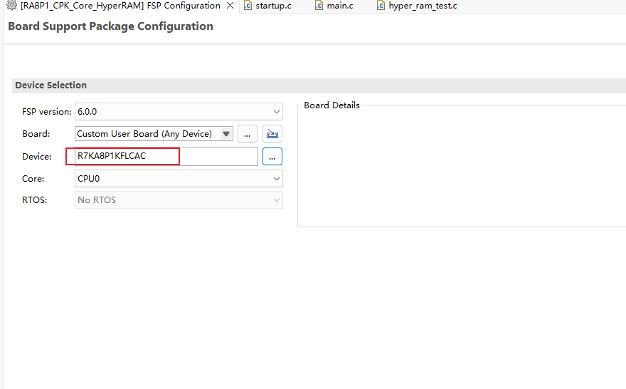
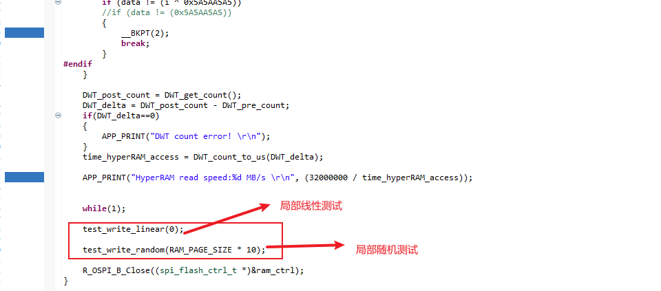

## 1.参考例程概述
该示例项目演示了基于瑞萨 FSP 的瑞萨 RA MCU 上 OSPI 驱动 HyperRAM 的基本功能。

### 1.1 创建新工程， BSP 选择相应的 FSP 版本、 Device 和 Board 类型

### 1.2 Stack 中添加 “OSPI  (r_ospi_b)” 模块，详细的属性设置请参考例程

### 1.3 Clocks 中设置 OCTACLK 为 266MHz

### 1.4 具体操作：
程序执起来后可以通过 J-link RTT Viewer 看到具体的代码运行情况。

#### 1.4.1 代码说明
如下图所示，程序初始化分别包括 HyperRAM 启动要求的复位操作， RA8P1 的 OSPI 接口的初始化操作,配置 HyperRAM 内部寄存器的操作，具体内容请查阅相关使用手册。

测试完读写速率之后，是对 HyperRAM 的局部线性和随机测试，这个前的 while(1), 可以看情况屏蔽掉，或者打开。

## 2. 支持的电路板：
CPKCOR-RA8P1

## 3. 硬件要求：
1 块瑞萨 RA核心板：CPKCOR-RA8P1

1 根 Type-C USB 数据线

## 4. 硬件连接：
通过 Type-C USB 数据线将 CPKCOR-RA8P1 板上的 USB 调试端口（JDBG）连接到主机 PC。

