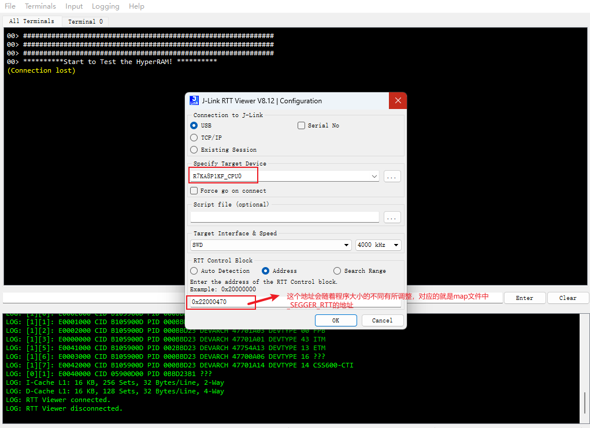
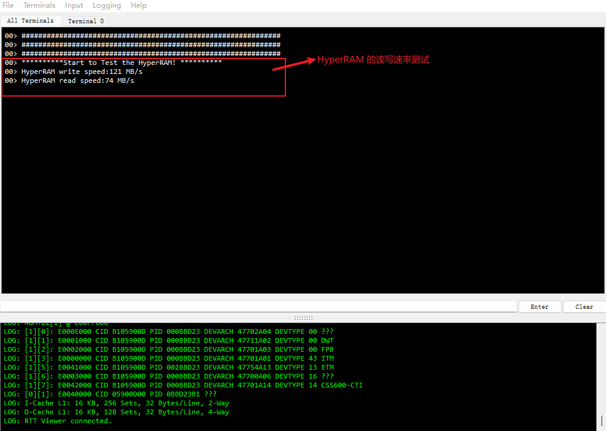

该示例工程由 瑞萨电子-Deane 提供，2025年10月14日

# 工程概述
该示例工程演示了基于 CPKCOR-RA8P1 开发板去配置 W958D8NBYA HyperRAM 寄存器和使用内存映射的方式进行读写的操作 

# 支持的开发板 / 演示板
CPKCOR-RA8P1

# 硬件要求
- 1 块 Renesas RA8 开发板：CPKCOR-RA8P1
- 1 根 USB Type A->Type C 或 Type-C->Type C 线 （支持 Type-C 2.0 即可）

# 硬件连接
- 通过 USB Type-C 线连接调试主机和 CPKCOR-RA8P1 板上的 USB 调试端口。

# 硬件设置注意事项
 无

# 软件开发环境
- FSP 版本： FSP 6.0.0
- 集成开发环境和编译器： e2studio 2025-07 + LLVM for ARM 18.1.3

# 第三方软件
无

# 操作步骤
- 打开 e2stuio 并导入工程
- 编译，完成调试配置，烧录程序到开发板上
- 打开 Jlink-RTT Viewer 连接开发板，按如下提示说明进行操作
  
  
#### 示例工程详细的配置和使用方法，请参考下面的说明文件
[RA8P1_CPK_Core_HyperRAM](RA8P1_CPK_Core_HyperRAM.md)