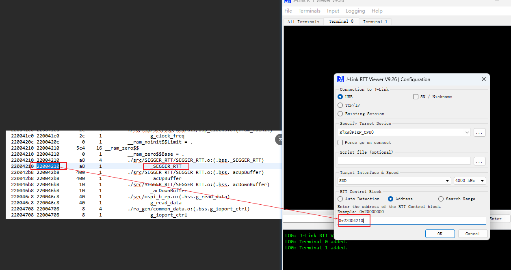
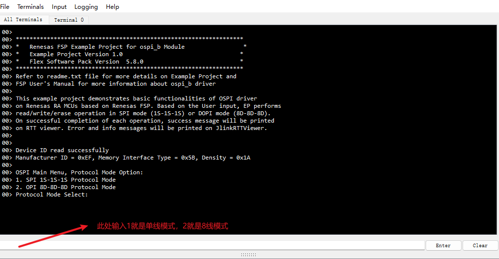
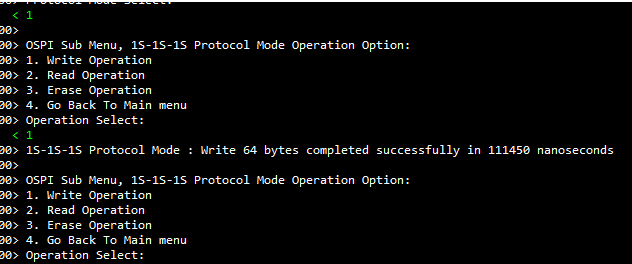
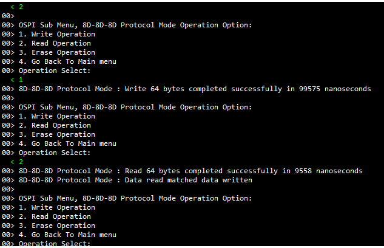

该例程由瑞萨电子-Deane提供， 2026-01-28

工程概述：
    • 该例程在是在RA8D1 EK板上，Infineon S28HS512T的基础上改进而来。支持单线1S-1S-1S协议与8线8D-8D-8D协议的Flash读写操作，在8线ODDR模式下，可以实现内存映射模式的读操作。

支持的开发板/演示板:
    • CPKCOR_RA8P1

硬件要求：
    • 1块 Renesas RA8开发板：CPKCOR-RA8P1
    • 1根 USB Type A->Type C 或 Type-C->Type C 线 （支持 Type-C 2.0 即可）
硬件连接：
    • 通过 USB Type-C 线连接调试主机和 CPKCOR-RA8P1 板上的 USB 调试端口。

软件开发环境：
    • FSP版本
        ○ FSP 6.1.0
        ○ Board：CPKCOR-RA8P1 + Octa-Flash
        
        
集成开发环境和编译器：
    • e2studio v2025-07 + LLVM for ARM 18.1.3

第三方软件
    • 无
    
操作步骤：
    • 打开e2stuio 并导入工程
    • 编译，完成调试配置，烧录程序到开发板上
    • 打开Jlink-RTT Viewer 连接开发板，按如下提示说明进行操作
    
    
    
    

**详细的样例程序配置和使用，请参考下面的文件。**

[ospi_nor_cpkhmi_ra8p1_llvm](ospi_nor_cpkhmi_ra8p1_llvm.md)

