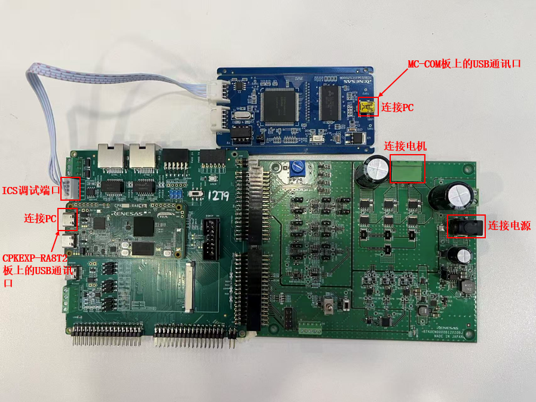

该示例工程由 瑞萨电子-徐海龙 提供，2025年10月11日

# 工程概述

该示例工程演示了基于瑞萨 FSP 的 RA8T2 MCU 控制 sensorless 样例 motor 的一般运转功能。

# 支持的开发板/演示板
CPKEXP-RA8T2

# 硬件要求

- 1 块 Renesas RA8 开发板：CPKEXP -RA8T2
- 1 块 Renesas 低压驱动板：MCI-LV-1
- 1 块 Renesas 电机 ics 通讯板：MC-COM
- 1 个 24V 便携电源（ 3A 以上输出）
- 1 台 24V 可驱动的 PMSM 电机，推荐 R42BLD30L3 (MOONS’) 
- 1 根 4P XH2.54 联接线
- 2 根 USB Type A->Type C 或 Type-C->Type-C 线（支持 Type-C 2.0 即可）

# 硬件连接

- 将 CPKEXP -RA8T2 的 CN1、CN2 和低压驱动板 MCI-LV-1 相应接口（参照图例）对插
- 将 24V 可驱动 PMSM 电机联接到低压驱动板 CN2 （请按旁边丝印 U, V, W 线序提示联接）
- 用联接线 4P XH2.54 联接 CPKEXP -RA8T2 和 ics 通讯板 MC-COM（AVDD 接 CN1.1, P707 接 CN1.2， P706 接 CN1.3， DGND 接 CN1.4）
- 通过 USB Type-C 线连接调试主机和 CPKEXP -RA8T2 板上的 USB 调试端口
- 通过 USB Type-C 线连接调试主机和 MC-COM 板上的 USB 通讯口
- 用 24V 便携电源给低压驱动板 MCI-LV-1 供电（可使用 J1 圆接头，或者 CN1.1 接高电平， CN1.2 接低电平）

# 硬件设置注意事项

建议最后联接电源，其他联接确认无误后，再供电

# 软件开发环境

- FSP 版本：FSP 6.1.0
- 集成开发环境和编译器：e2studio 2025-07 + GCC 13.2.1

# 第三方软件
无

#### 示例工程详细的配置和使用方法，请参考下面的说明文件
[motor_sensorless_cpkexp_ra8t2_ep](motor_sensorless_cpkexp_ra8t2_ep.md)

