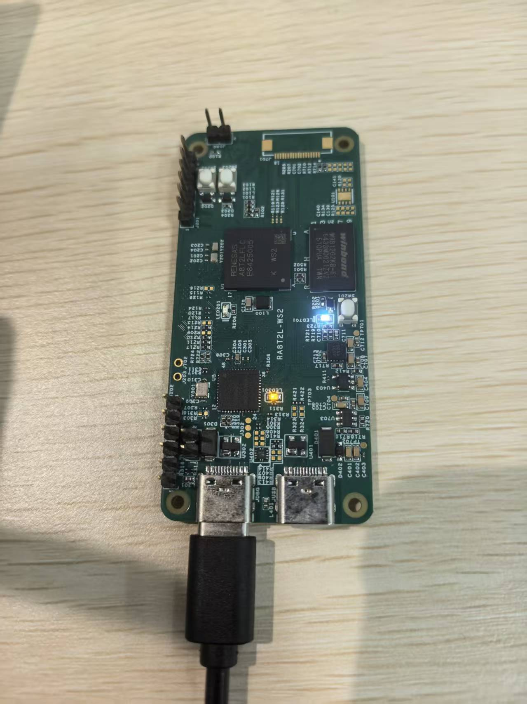

该示例工程由 瑞萨电子-Deane 提供，2025年10月20日

# 工程概述

该示例工程演示了基于 CPKNET-RA8T2 的 SDRAM 驱动及读写速率的测试。

# 支持的开发板 / 演示板
CPKNET-RA8T2

# 硬件要求
- 1 块 Renesas RA8 开发板： CPKNET-RA8T2
- 1 根 USB Type A->Type C 或 Type-C->Type C 线 （支持 Type-C 2.0 即可）

# 硬件连接
- 通过 USB Type-C 线连接调试主机和 CPKNET-RA8T2 板上的 USB 调试端口。

# 硬件设置注意事项
 无

# 软件开发环境
- FSP 版本： FSP 6.1.0
- 集成开发环境和编译器： e2studio 2024-04 + LLVM for ARM 18.1.3

# 第三方软件
无

# 操作步骤
- 打开工程
- 注意 board_sdram.c 中的宏： BSP_PRV_SDRAM_SDADR_ROW_ADDR_OFFSET 和 BSP_PRV_SDRAM_BUS_WIDTH，该板子分别对应的是 8 和 1，
  如果需要测试其他 SDRAM ，根据 spec 修改这两个宏
- 编译，烧录

#### 示例工程详细的配置和使用方法，请参考下面的说明文件
[sdram_cpknet_ra8t2_ep_readme](sdram_cpknet_ra8t2_ep_readme.md)

