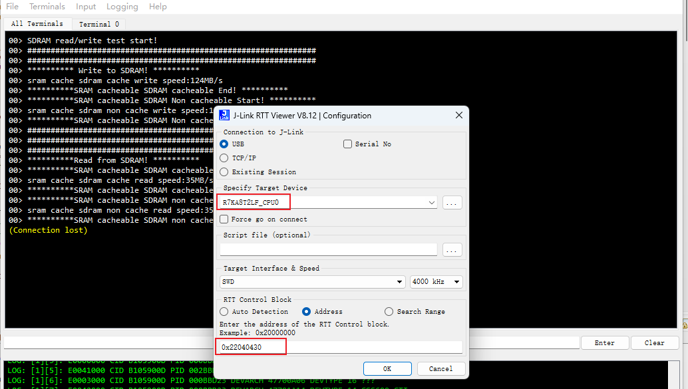

## 1.参考例程概述
该示例项目演示了基于瑞萨 RA8T2 SDRAM 性能测试的功能，本工程通过DWT counter计算读写SDRAM的时间，并通过J-Link RTT打印输出对应的结果。

### 1.1 打开工程

### 1.2 编译，下载，运行

## 2. 结果分析

### 2.1 读写速率测试
发现把D-Cahce打开的时候，会有读写一致问题。因为这批板上用的是RA8T2用的是WS2的批次的芯片。据说是Cache还有一些问题。所以后续会在ES3批次的芯片通一步验证!

* 打开 BENCH_MARK 这个宏定义会对SDRAM的读写速率进行测试，关闭这个宏定义会对SDRAM做全功能的读写测试

## 4. 支持的电路板：
CPKNET-RA8T2

## 5. 硬件要求：
1块瑞萨 RA8D1 HMI板：CPKNET-RA8T2

1根 Type-C USB 数据线

## 6. 硬件连接：
通过Type-C USB 数据线将 CPKNET-RA8T2板上的 USB 调试端口（JDBG）连接到主机 PC
连接屏幕到板子