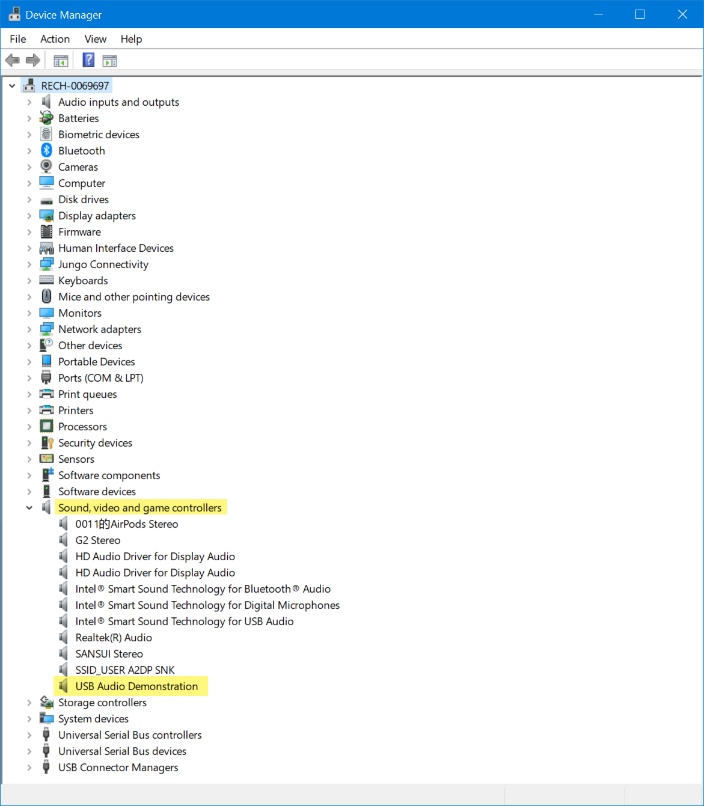
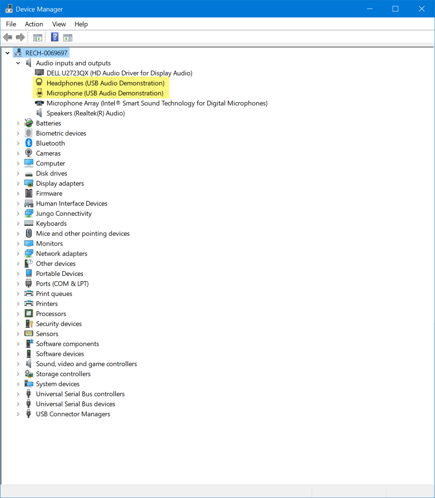

## 1.参考例程概述
该示例项目演示了基于瑞萨 FSP 的瑞萨 RA MCU在AzureRTOS下作为PAUD的基本功能。当代码运行时，RA8D1可以作为USB PAUD设备和PC通信。
代码流程说明如下：
上电后，MCU作为PVND设备和HVND通信，建立通信后，HVND向PVND写入15字节数据并都会，此例程验证需要一个HVND支持。

### 1.1 创建新工程，BSP选择“CPK-RA8D1B Core Board”，RTOS选择AzureRTOS。
### 1.2 Stack中添加“USB PAUD”，详细的属性设置请参考例程
### 1.3 利用一根USB线连接芯片的JUSB和HVND的JUSB。
### 1.4 在e2 studio中调试代码，代码自由运行。打开RTT Viewer，可以看到如下Log打印，可以看到设备初始化成功：

### 1.5 在PC端打开设备管理器，确认有以下设备

继续确认有以下设备

### 1.6 在PC端播放一段音频（wav格式，mp3格式等），播放软件如Audacity。此时MCU会录音并将从PC收到的数据存在RAM上。
### 1.7 当播放完成后，在PC端利用Audacity进行录制。此时MCU会根据收到的来自PC的请求将数据传给PC。
### 1.8 导出Audacity录制的音频，另存到电脑上。
### 1.9 导入刚才录制的视频并播放，对比录制的视频和原始视频，会发现他们非常接近。如果录制的格式和播放的不同，则音质可能会略有差别。
## 2. 支持的电路板：
CPKCOR-RA8D1B

## 3. 硬件要求：
1块瑞萨 RA核心板：CPKCOR-RA8D1B

2根Type-C USB 数据线，1根用于连接JDBG和PC，另一根用于连接两块板子的JUSB。

## 4. 硬件连接：
通过Type-C USB 电缆将 CPKCOR-RA8D1B板上的 USB 调试端口（JDBG）连接到主机 PC。另一根USB线缆连接板子的JUSB和PC。