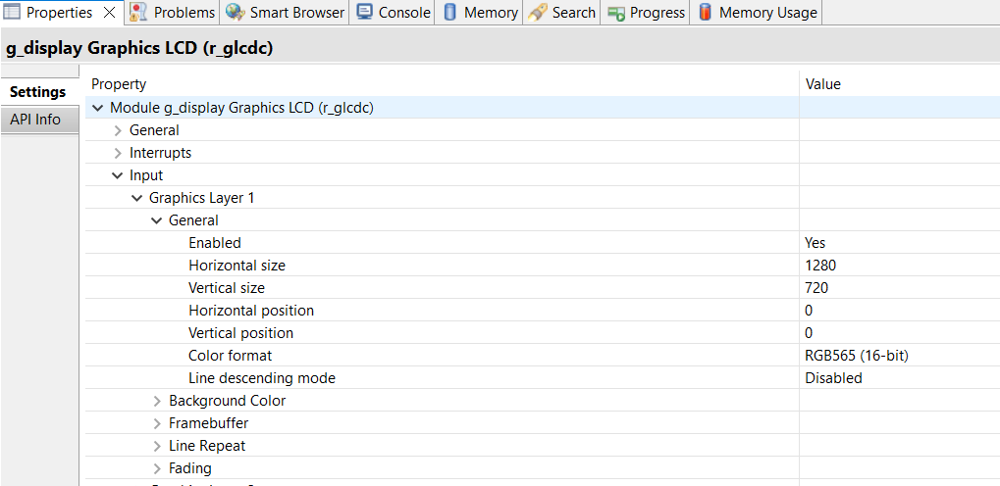
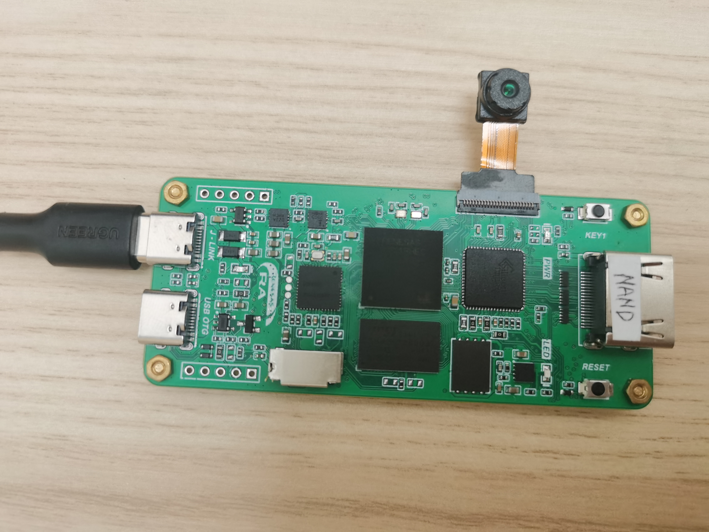
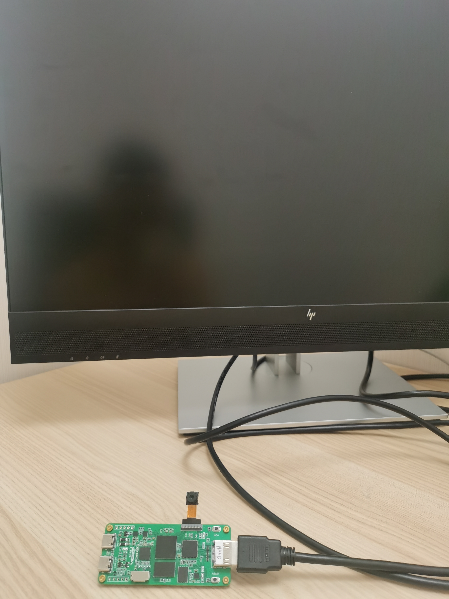
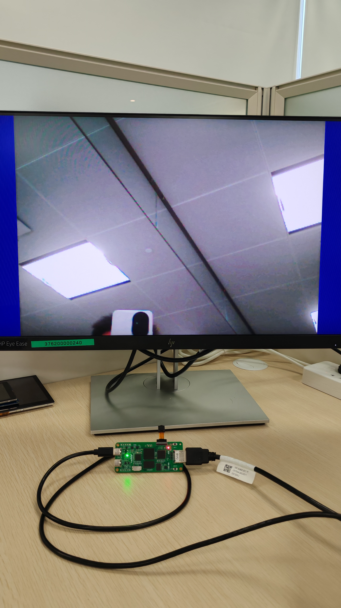

## 1.参考例程概述
该示例项目演示了基于瑞萨 RA8D1 HDMI 和 CEU 摄像头采集和实时显示的功能

### 1.1 打开工程
### 1.2 可以打开 /src 下的 sii902_linux.c 对 HDMI 的输出格式进行配置，这个配置需要和 GLCDC 的配置对应起来，比如这里配的是 720P，那么在 GLCDC stack 中配置的也应该是 720P：
```
siHdmiTx_VideoSel(HDMI_720P60);
```
改函数对应的参数如下，这些参数可以在 sii902_linux.h 中找到。由于目前RA8D1最高只支持720P，所以这里对应最高为720P
```
//====================================================
// Video mode define
#define HDMI_480I60_4X3	1
#define HDMI_576I50_4X3	2
#define HDMI_480P60_4X3	3
#define HDMI_576P50_4X3	4
#define HDMI_720P60			5
#define HDMI_720P50			6
#define HDMI_1080I60		7
#define HDMI_1080I50		8
#define HDMI_1080P60		9
#define HDMI_1080P50		10
//zhy+ Begin
#define HDMI_1080P25		11
#define HDMI_1080P30		12
#define HDMI_1080P24		13
```



### 1.3 连接摄像头，如下：



### 1.4 连接显示器，需要使用支持刷新率在 30Hz~60Hz 的显示器。这里推荐一个HP的一款显示器，或是使用老式电视机做显示器。


直接用 HDMI 线连接：




### 1.5 编译，下载，运行


## 2. 显示结果

### 2.1 最后显示如下




## 3. 支持的电路板：
CPKDIS-RA8D1B

## 4. 硬件要求：
1块瑞萨 RA8D1 HMI板：CPKDIS-RA8D1B

1根 Type-C USB 数据线

1块 显示器

1个 OV7725 摄像头

## 5. 硬件连接：
1. 通过Type-C USB 数据线将 CPKDIS-RA8D1B板上的 USB 调试端口（JDBG）连接到主机 PC
2. 连接显示器
3. 连接OV7725到板子
