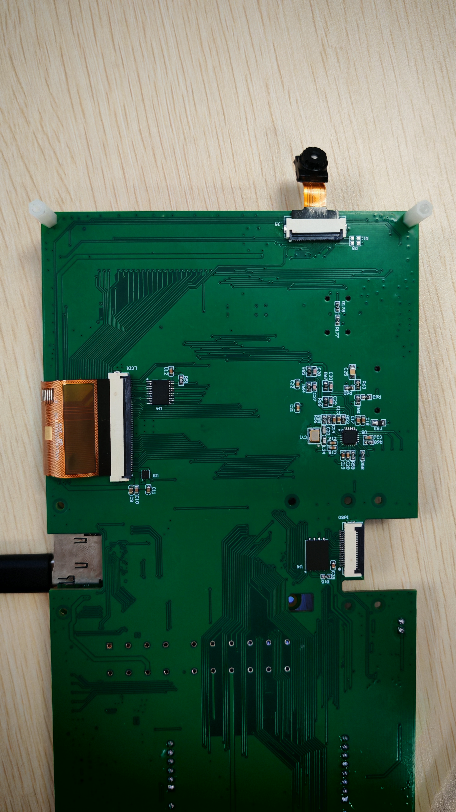
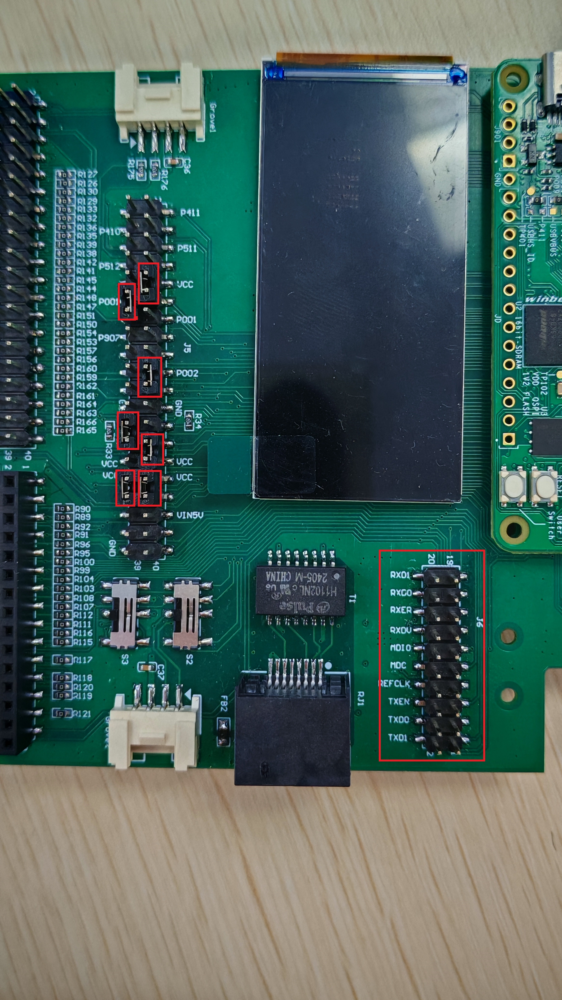
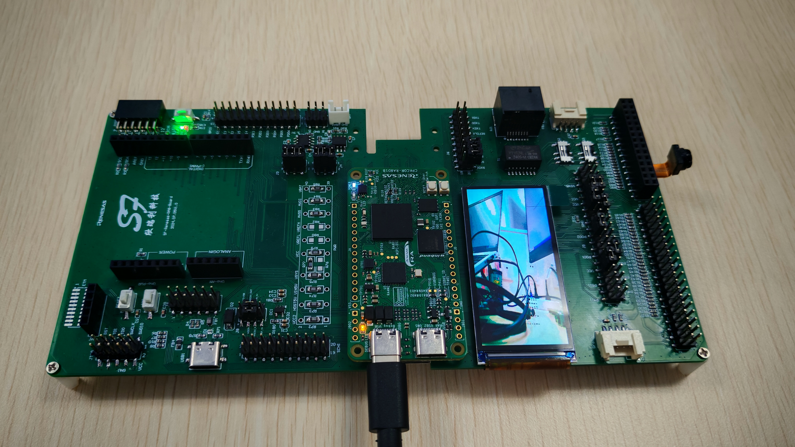

## 1.参考例程概述
该示例项目演示了基于瑞萨 RA8D1 CEU 实时显示摄像头数据的功能

### 1.1 打开工程
### 1.2 可以打开 /src 下的 hal_entry,选择对应的宏，使能OV7725的代码初始化：
```
#if 1
    /* Initialize OV7725 camera sensor */
    err = ov7725_open();
    /* Handle error */
    if(err != FSP_SUCCESS){
        APP_PRINT( "** ov7725_open API failed ** \r\n");
    }
    OV7725_Window_Set(VGA_WIDTH, VGA_HEIGHT, 1);
#else
    ov5640_init();
    ov5640_set_output_format(OV5640_OUTPUT_FORMAT_RGB565);
    ov5640_auto_focus_init();
//    ov5640_set_test_pattern(OV5640_TEST_PATTERN_COLOR_BAR);
    ov5640_set_output_size(VGA_WIDTH,VGA_HEIGHT);
    ov5640_set_exposure_level(OV5640_EXPOSURE_LEVEL_8);
#endif

```

### 1.3 连接屏幕和摄像头，如下：



### 1.4 J5,J6跳线帽，断开J6所有的跳帽连接，J5选择如下：




### 1.5 编译，下载，运行


## 2 最后显示如下




## 3. 支持的电路板：
CPKCOR+扩展板

## 4. 硬件要求：
* 1块 Renesas RA8开发板：CPKCOR-RA8D1B
* 1根 USB Type A->Type C 或 Type-C->Type C 线 （支持 Type-C 2.0 即可）
* 1个 MIPI 显示屏，型号是H0233S001 V1，驱动芯片是ST7796U
* 1个 扩展板
* 1个 OV7725 摄像头模组

## 5. 硬件连接：
通过Type-C USB 数据线将 CPKCOR-RA8D1B 板上的 USB 调试端口（JDBG）连接到主机 PC
连接屏幕和摄像头到板子