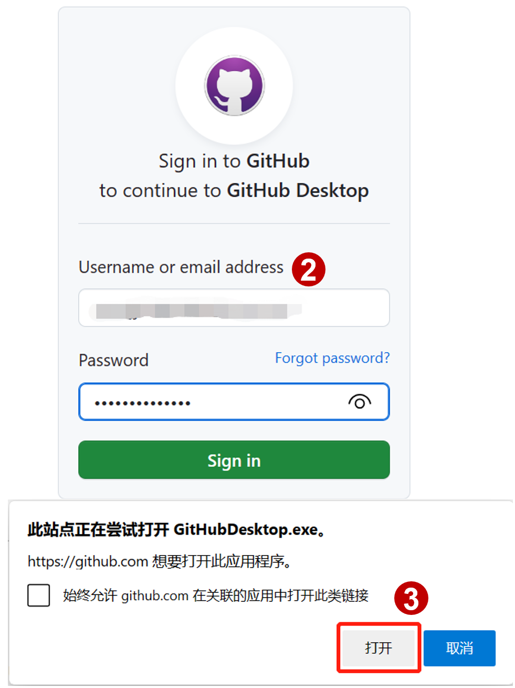
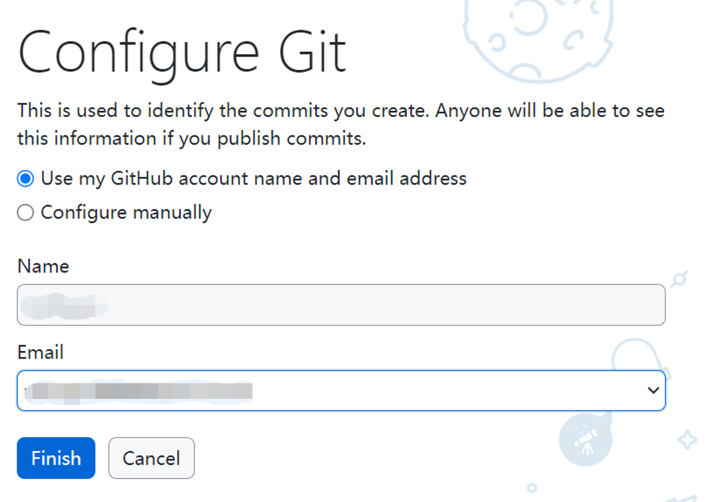
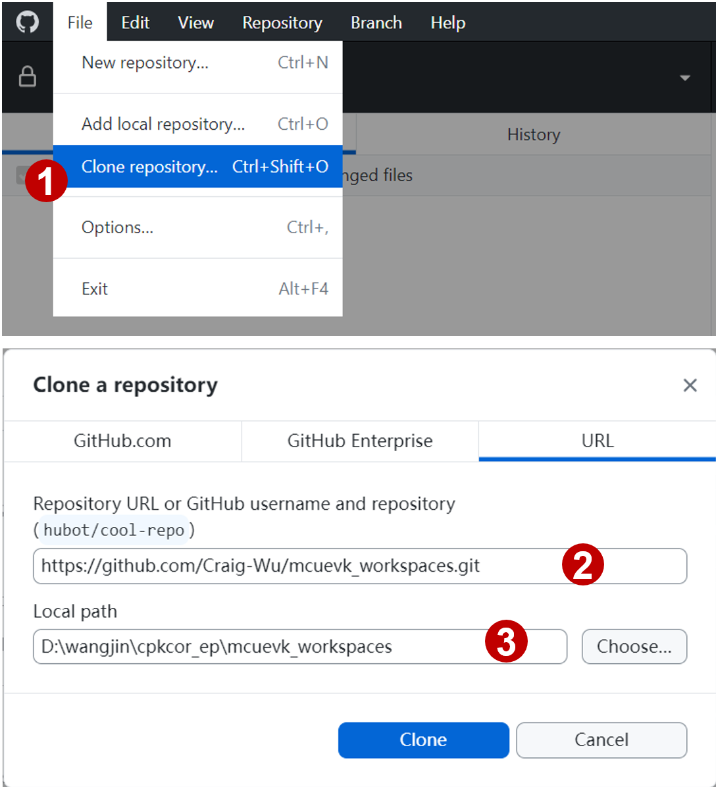
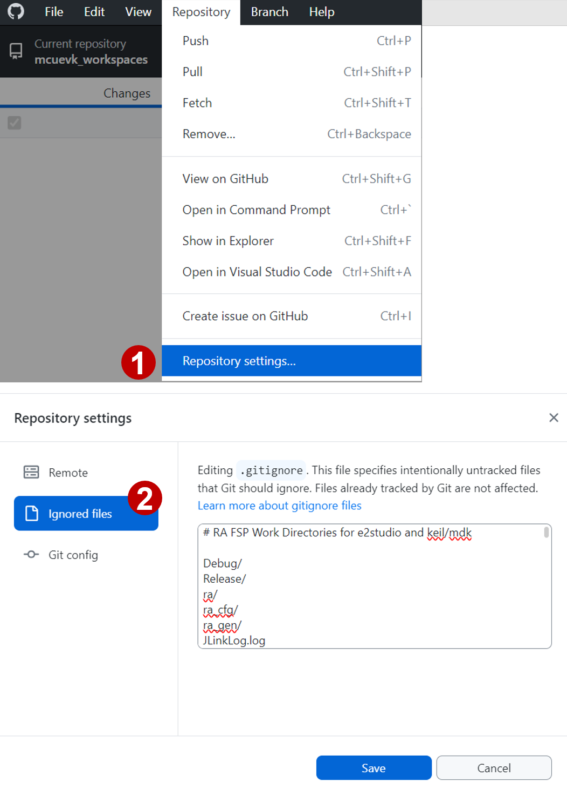
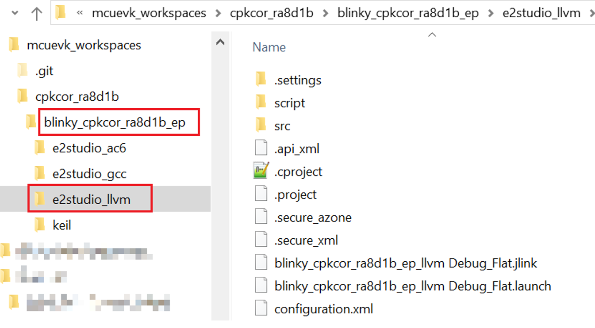
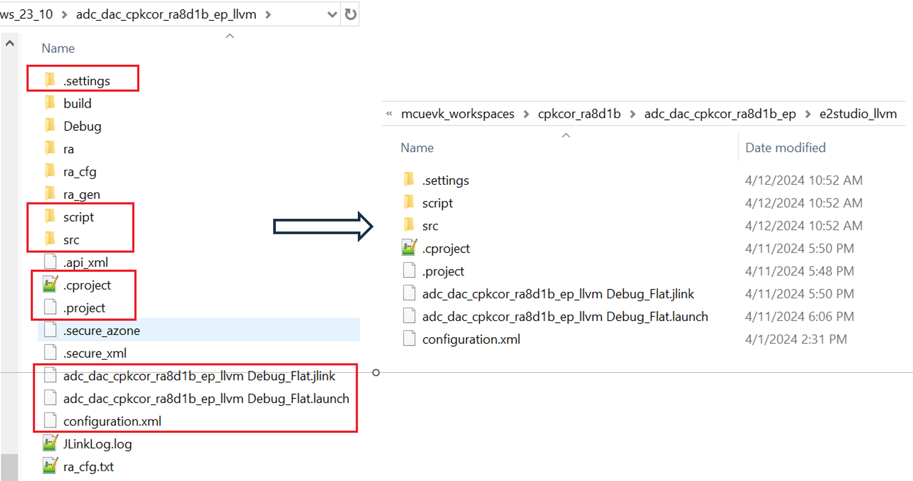
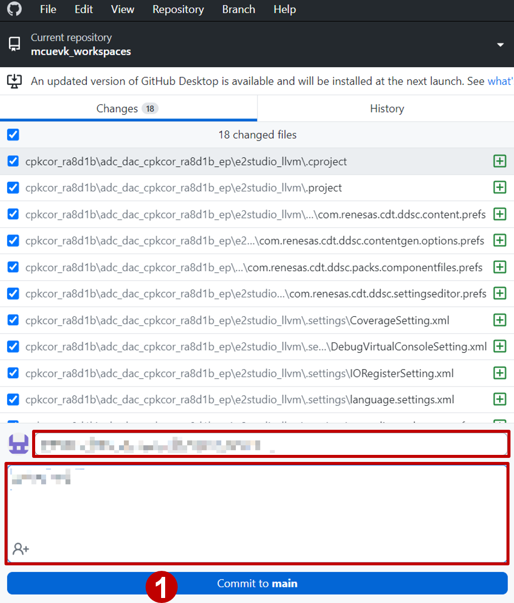
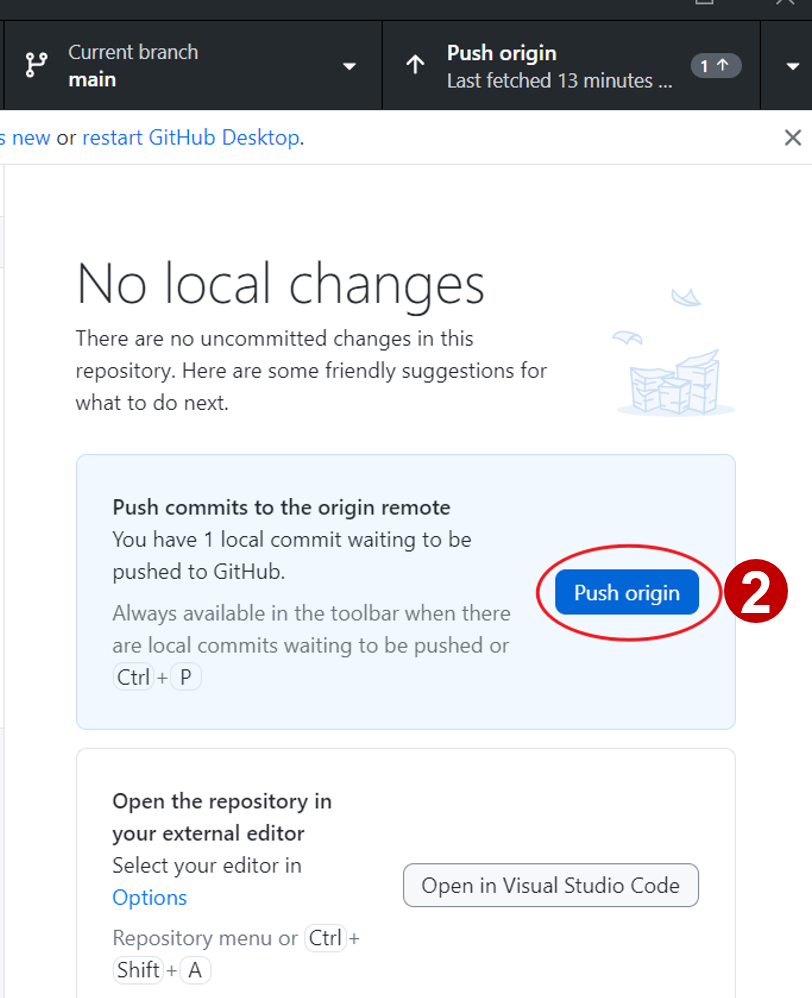
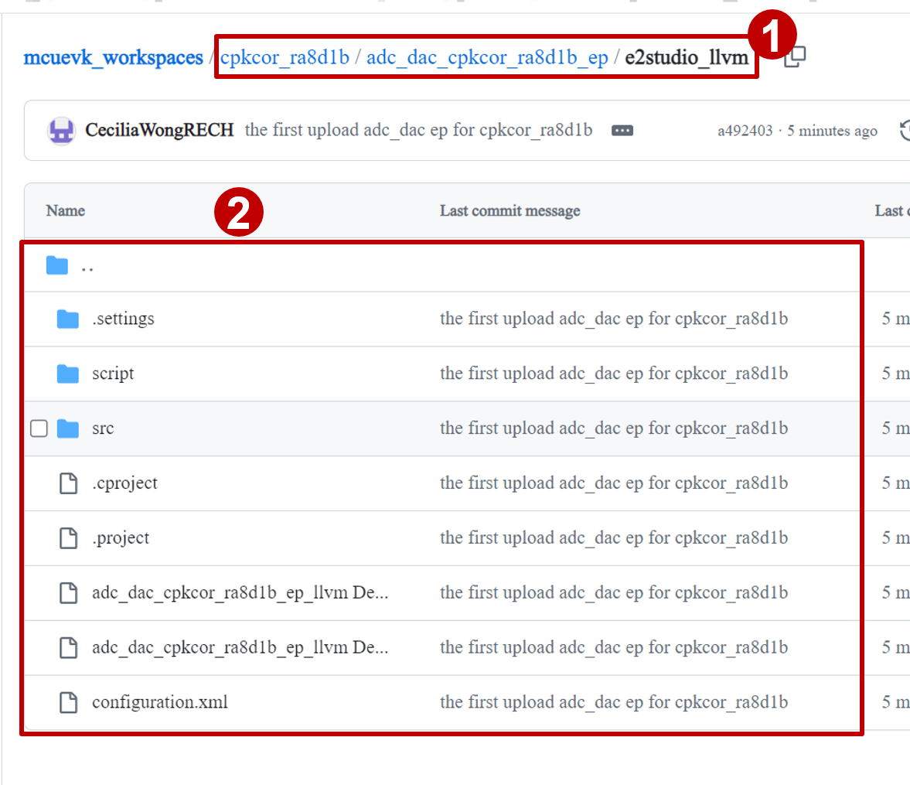

### GitHub准备（注册账号&安装GitHub Desktop）

* 在[Github官网](https://github.com/) 注册账号
* 记录登录名和密码

   

* 此教程使用GitHub Desktop来pull和push样例工程，在 [Github Desktop官网](https://desktop.github.com) 下载软件包并安装。
* 启动GitHub Desktop，选择Sign in to GitHub.com，网页浏览器中输入用户名和密码，遇到提示应用程序选择“打开”

   

   

* 在Configure Git界面分别配置Name和Email

   

### Clone repo to local

* File > Clone repository…
* Clone a repository > URL

   https://github.com/Craig-Wu/mcuevk_workspaces.git

* YOUR LOCAL PATH

   

* 确认repository settings
* 检查Ignore files设定，确认以下内容位于顶端，点击Save
   ```
    # RA FSP Work Directories for e2studio and keil/mdk
    Debug/
    Release/
    ra/
    ra_cfg/
    ra_gen/
    JLinkLog.log
    build/
    Listings/
    Objects/
    JLinkLog.txt
    .api_xml
    .gitignore
    .secure_azone
    .secure_xml
    ```

    


### 按照样例代码开发提交流程创建readme.md并开发样例工程


### 如果您使用非代码仓库目录进行样例工程的开发，请先将样例工程拷贝到本地代码仓库

1. 在本地仓库的样例代码文件夹中添加示例工程文件夹
   
    

2. 拷贝样例工程内容到本地代码仓库对应的路径下，包括
   ```
   .settings
   script
   src
   .cproject
   .project
   ***.jlink
   ***.launch
   configuration.xml
   ```

   


### Commit and Push 

1. 在GitHub Desktop Changes界面确认要上传的内容，红框内输入本次提交的相关说明，点击Commit to main

   

2. 点击Push origin

    

3. 在Github远程仓库中确认结果。
    
   * 浏览器中打开[此链接](https://github.com/Craig-Wu/mcuevk_workspaces.git)，确认内容已上传。
  
   
    