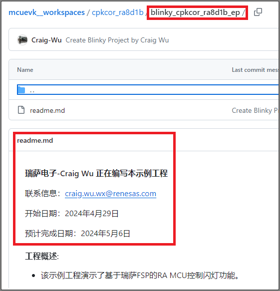
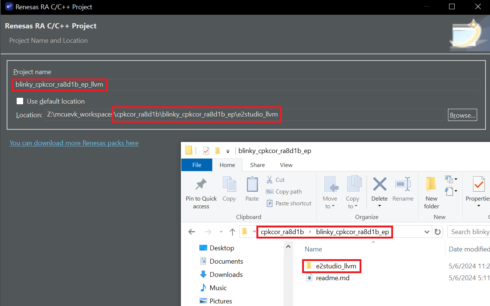
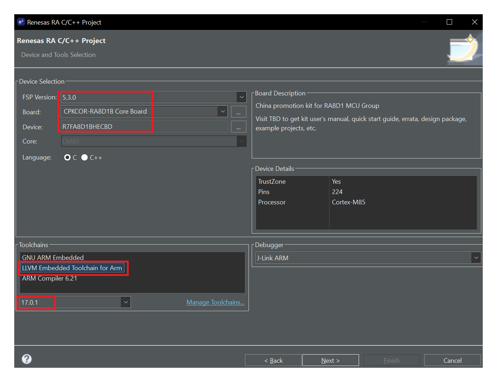
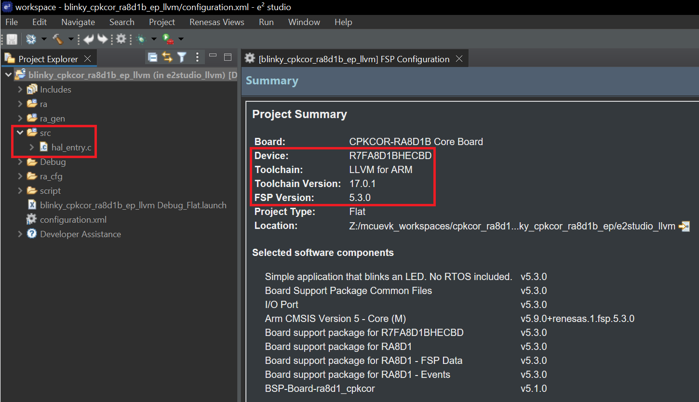
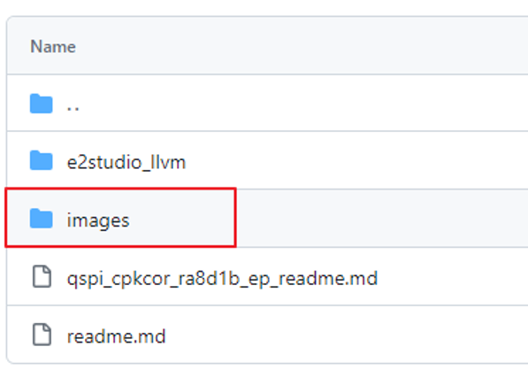
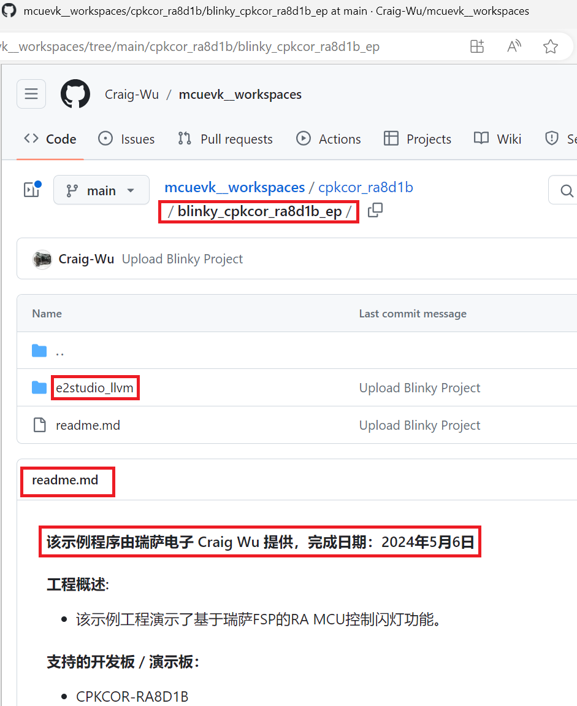

## RECN 瑞萨EVK样例代码开发提交流程

此流程以CPKCOR-RA8D1B开发板和e2studio开发环境为例。

如果您不熟悉Git，请查看针对此样例代码开发流程的[Github使用教程](github_ops.md)

### I. 声明想要开发的样例代码

Clone https://github.com/Craig-Wu/mcuevk_workspaces 到本地，在对应的开发板目录下建立您的样例程序目录，命名规则为`样例名称_开发板名称_ep`。例如：`blinky_cpkcor_ra8d1b_ep`。

由于瑞萨集成开发环境e2studio的限制，在所有的文件夹和文件名中不要使用横杠(减号)，请使用下划线。为了统一，请仅使用**小写英文字母**。

创建readme.md，声明您已经在开发这个样例程序，请在readme文件里填写以下信息。可参考[样例文件](readme_template.md)。

```
xxx （请填入您的名字和公司） 正在编写本示例工程
联系信息：（电子邮件，手机号等）
开始日期：
预计完成日期： 
```
将项目推送到远程仓库，确认代码仓库下已经有了您刚才建立的目录和文件。
   * 如果您不熟悉Git的使用，请查看针对此样例代码开发流程的[Github使用教程](github_ops.md)中的`推送`部分




### II. 创建示例工程并开发样例代码

您可以使用您熟悉的开发工具来创建示例工程以及编写代码，为了统一格式，示例工程请遵循以下规则。

1. 瑞萨的MCU支持多种开发环境和编译器，请为每个示例工程手工创建一个目录，以"集成环境 + 编译器"命名，第三方开发环境可能只支持一种编译器，此时可省略编译器名称。请在readme中注明具体的集成开发环境和编译器版本。

 

2. 创建工程。您可以在本地任意目录（例如e2studio的缺省Workspace目录）创建工程，也可以直接在本地代码仓库的存储位置创建工程。
   
   如果使用e2studio，请将工程名称定为`样例名称_开发板名称_ep_编译器`，使用非e2studio缺省的Workspace目录时需要手动指定工程目录。这主要是为了可以在e2studio中同时打开使用不同编译器的相同工程，在e2studio的界面上可读性也比较强。

   如果您创建的是RA8 MCU的示例工程，请选择FSP5.3.0或更高版本，使用LLVM编译器。

   

   


3. 编写样例代码。e2studio和RASC创建的RA示例工程开发时请遵循FSP的代码目录结构，用户代码放在src下，不要放在ra，ra_gen等目录下，这些目录下是FSP自动生成的代码，更新FSP配置时会被覆盖。使用其他开发环境时请先确认仓库的同步设定，具体请查看.gitignore文件

   

4. 检查/添加样例代码的License信息。从FSP 5.3.0起，FSP代码改为使用BSD License，如果您的公司对License没有特别的要求，请也使用BSD License，在每个源文件的头部请确保有License信息，瑞萨的BSD License的样例如下，请对应进行修改
   ```
    /*
    * Copyright (c) 2020 - 2024 Renesas Electronics Corporation and/or its affiliates
    *
    * SPDX-License-Identifier: BSD-3-Clause
    */
   ```
   * 如果您公司对样例代码的License有特定的要求，请先联系瑞萨确认是否可以将放到本代码仓库
   * 请不要在样例程序中使用GPL License的代码
  
5. 如有必要，编写示例工程及样例代码的说明文件和使用教程，文件名为`样例代码目录名_readme.md`，图片统一存放在images目录下。下图为QSPI Flash样例代码目录下的说明文件
   
   

### III. 推送示例工程

开发测试完成后，更新readme.md，并推送样例代码到远程仓库。
   * 如果您不是在本地仓库目录直接开发，请先将示例工程导出到本地仓库对应的位置

  

瑞萨人员看到更新完成的readme文件，就会将项目搬移到[发布样例代码的Github仓库](https://github.com/renesas/cpk_examples)

如果您不熟悉Git的使用，请查看针对此样例代码开发流程的[Github使用教程](github_ops.md)
