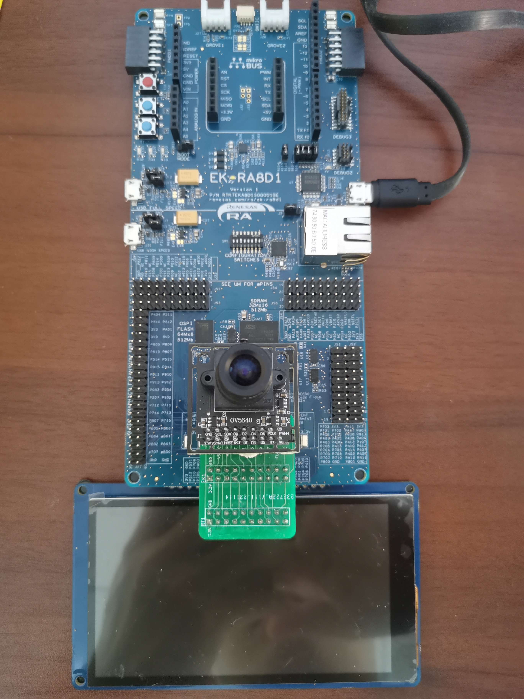
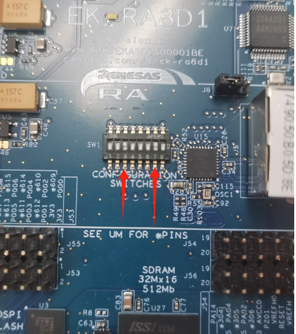
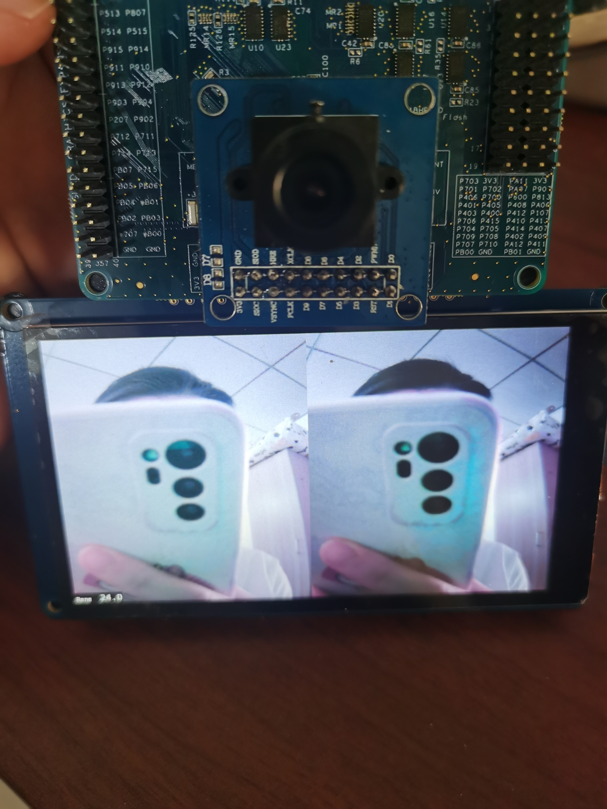

### 工程概述:
- 该示例工程演示了基于瑞萨FSP的RA8 MCU 的 CEU 模块采集摄像头数据和显示的功能。适配摄像头OV7725/OV5640

### 支持的开发板 / 演示板：
- EK-RA8D1

### 硬件要求：
- 1块Renesas RA8开发板：EK-RA8D1
- 1根USB Type A->Micro B 线
- OV5640和OV7725 摄像头模组，如果使用OV5640需要一个转接板
  转接板的信号连接如下：


- EK-RA8D1自带MIPI屏

### 硬件连接：
- 通过 USB 线连接PC和 EK-RA8D1 板上的 USB 调试端口
- 连接 EK-RA8D1 和摄像头模块
- 连接MIPI屏
  
   整体连接如图所示：




### 硬件设置注意事项：
- SW1-3 和 SW1-7 要切换到 "ON"



### 软件开发环境：
- FSP版本
  - FSP 5.1.0
- 集成开发环境和编译器：
  - e2studio v2024-01 + LLVM v17.0.1

#### 第三方软件
- 无

#### 操作步骤：

1. 打开工程
2. 注意 hal_entry.c 的代码：
```
    #if 0 
        /* Initialize OV7725 camera sensor */ 
        err = ov7725_open(); 
        /* Handle error */
        handle_error(err, "** ov7725_open API failed ** \r\n");
        OV7725_Window_Set(VGA_WIDTH, VGA_HEIGHT, 1);
    #else
        /* Initialize OV5640 camera sensor */ 
        ov5640_init();
        ov5640_set_output_format(OV5640_OUTPUT_FORMAT_RGB565);
        ov5640_auto_focus_init();
    //    ov5640_set_test_pattern(OV5640_TEST_PATTERN_COLOR_BAR);
        ov5640_set_output_size(VGA_WIDTH,VGA_HEIGHT);
        ov5640_set_exposure_level(OV5640_EXPOSURE_LEVEL_8);
    #endif
```
通过这部分代码选择对应的摄像头模组
3. 编译，烧录，运行后MIPI可以显示摄像头采集到的图像：



